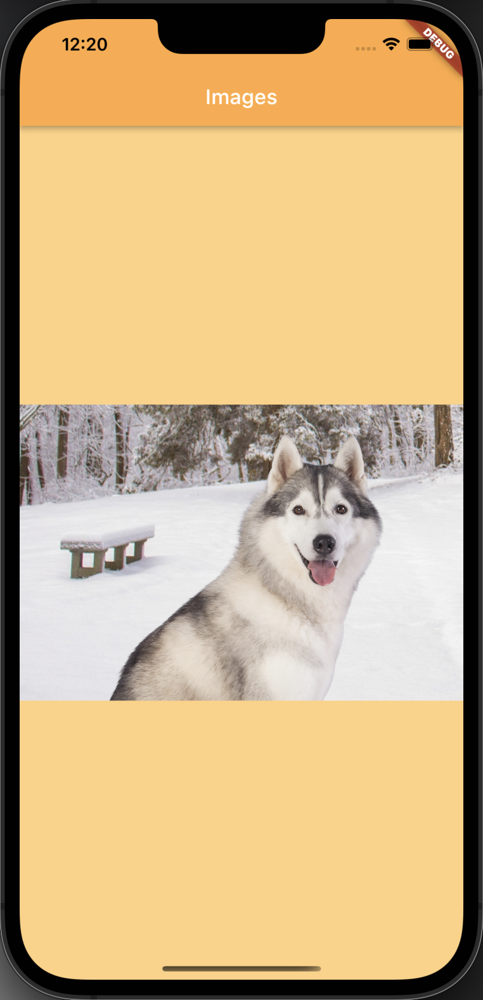
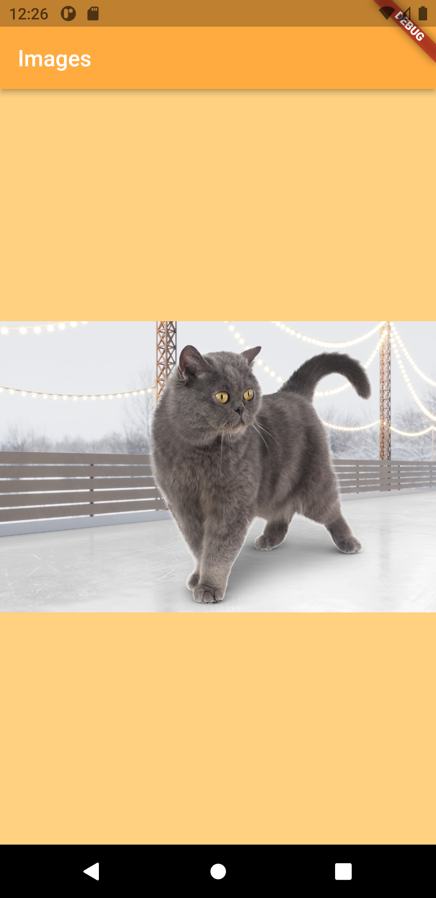

# Display Images In Flutter

Simple app to display images in a flutter. In this demo app, we display the images from the Assets folder and from the network (fetch an image from URL).

## Build On
- Flutter 2.8.1
- Dart 2.15.1

## What we learn here
- In this demo, we learned the following widgets
  1. [MaterialApp](https://api.flutter.dev/flutter/material/MaterialApp-class.html)
  2. [Scaffold](https://api.flutter.dev/flutter/material/Scaffold-class.html)
  3. [AppBar](https://api.flutter.dev/flutter/material/AppBar-class.html)
  4. [Text](https://api.flutter.dev/flutter/widgets/Text-class.html)
  5. [Center](https://api.flutter.dev/flutter/widgets/Center-class.html)
  6. [Image](https://api.flutter.dev/flutter/widgets/Image-class.html)
- How to add an image to the project and how to display it.
- How to display images from the network.
- How to change the background color.
- How to center the widgets.

## Screenshots

### iPhone

### Android

## Contact
**Name:** Manish Ahire
**Portfolio:** [www.manishahire.com](https://www.manishahire.com/)
**Blog:** [www.mobodevstuff.com](https://www.mobodevstuff.com/)